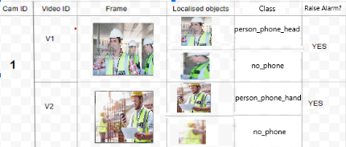

CCTV Phone Usage Detection
                  
Problem Statement: This project is aiming at detecting cell phone usage events from surveillance videos. All the videos are shot using multiple surveillance cameras, each having its own resolution, frame rate and range. One example of such an event could be the detection of events where an employee is using his/her cell phone to make a call.

Adapted Methodology (YOLO) :

2 Stage Detection and Classification Model:

1.	 Person Localization : Acquire Region of Interest(RoI) from the input video frames using pre-trained YOLOv3 or YOLOv3-spp models and pass them to the classification model. ROIs here are all the persons present in the frame.
2.	Person Classification : Classify each person parsed  as ( no_phone, person_phone_hand, person_phone_hand) using a custom trained classification model. The model used here is a custom trained YOLOv3-tiny model.

Training: (Classification Model)
     
     1. Training was done on a dataset consisting of web scraped images of persons using cell
         phones in different postures and angles. Training template attached for reference.
      2. Final model has an MAP of 92.64% on a validation set of (1601-178) train-val split.

Inferencing:
      
      1. Inferencing is being done on real time surveillance camera videos of the office using a pipeline of 
classification model on top of localization model in OpenCV.
     2. Getting decent results after fine tuning threshold and input image size (to class. model)
           parameters. Model to be tuned further.
3.	Lag to be reduced further. 

Model Size: 269 MB ( Localization Model: 236 MB, Classification Model: 33MB)

